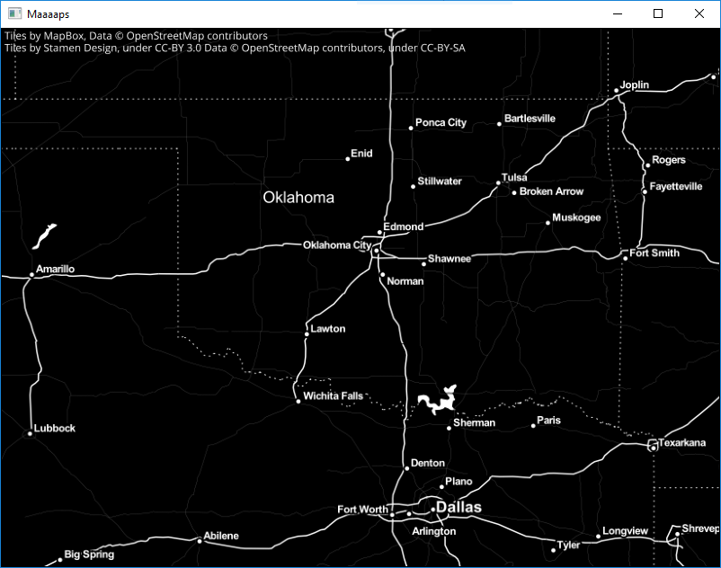

Vismap
======

Provides a Canvas for creating maps with Vispy.  The canvas gets its tiles from
a [TileProvider](vismap/tile_providers.py).  Several tile providers are
bundled with this project; adding a tile provider simply requires knowing the
URL at which to grab a tile, and providing the attribution text for the tiles.

Run the provided [example](example.py) to check out how interacting with the
map works.  Use the left and right arrow keys to change the tile provider.  The
script is installed as ``vismap-example`` if you install vismap; so from your
command line just run

    vismap-example

What's the Point?
-----------------

The idea is to be able to display real-time geographical data on top of a
map–for example, radar data.  This can be done now, but some assembly is still
required...

Example map:

